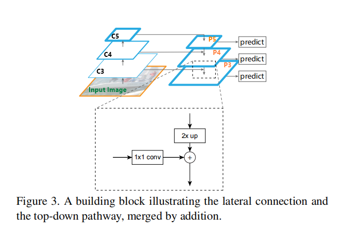
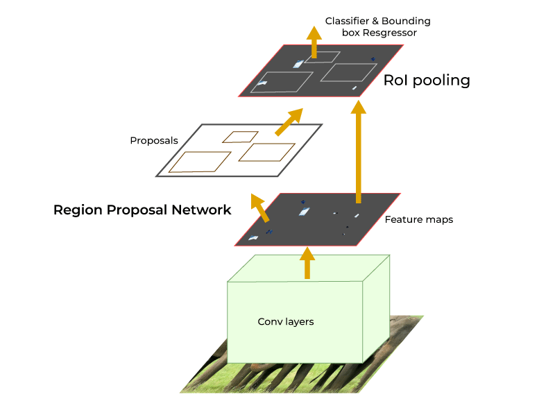

# RE-IMPLEMENT FCOS AND FASTER-CNN PAPER

**Note:** This project is, in fact, my assigment for [Deep Learning for Computer Vision](https://www.youtube.com/playlist?list=PL5-TkQAfAZFbzxjBHtzdVCWE0Zbhomg7r) provided
by Michigan University. I highly recommend this course for everybody who wants to have a more comprehensive grasp of important concepts in DL.
## 1. Backbone and Feature Pyramid Network (FPN)

First, we start building the backbone and FPN of our detector (blue and green parts above). It is the core component that takes in an image and outputs its features of different scales. It can be any type of convolutional network that progressively downsamples the image (e.g. via intermediate max pooling).
Here, we use a small [RegNetX-400MF](https://pytorch.org/vision/stable/models.html#torchvision.models.regnet_x_400mf) as the backbone so we can train in reasonable time on Colab. We initialize this backbone from pre-trained ImageNet weights and extract intermediate features `(c3, c4, c5)` as shown in the figure above.
These features `(c3, c4, c5)` have height and width that is ${1/8}^{th}$, ${1/16}^{th}$, and ${1/32}^{th}$ of the input image respectively.
These values `(8, 16, 32)` are called the "stride" of these features.
In other words, it means that moving one location on the FPN level is equivalent to moving `stride` pixels in the input image.
We add some convolutional block to turn this backbone in to FPN like in this following figure:

<p>
  

</p>

For more details, see Figure 3 in [FPN paper](https://arxiv.org/abs/1612.03144).
FPN will convert these `(c3, c4, c5)` multi-scale features to `(p3, p4, p5)`. These notations "p3", "p4", "p5" will, from now on, called feature maps at different levels.
Some pseudocode for more detail on how to implement FPN from backbone network:

```
# Create three separate 1x1 convolutional layer to perform 'lateral connection' (lateral arrow in figure 3)
        la3=nn.Conv2d(out_channels_c3,out_channels,(1,1))
        la4=nn.Conv2d(out_channels_c4,out_channels,(1,1))
        la5=nn.Conv2d(out_channels_c5,out_channels,(1,1))

# After extract multi-scale features c3,c4,c5 from backbone network (look at figure above to understand logic behind this implementation)
        p5=la5(c5)

        p4=la4(c4)
        p5_up=interpolate(p5,up_factor=2)  
        p4=p4+p5_up

        p3=la3(c3)
        p4_up=interpolate(p4,up_factor=2)
        p3=p3+p4_up

```
In reality, after obtaining p3,p4,p5; we will pass these through additional conv layers for better performance.
## 2. Fully-Convolutional One-Stage Object Detection

FCOS is a fully-convolutional one-stage object detection model — unlike two-stage detectors like Faster R-CNN, it does not comprise any custom modules like anchor boxes, RoI pooling/align, and RPN proposals (for second stage).

An overview of the model in shown below. In case it does not load, see [Figure 2 in FCOS paper](https://arxiv.org/abs/1904.01355).
It details three modeling components: backbone, feature pyramid network (FPN), and head (prediction layers). Two of those are explained in Section 1.
Head are just blocks of convolutional layers that are connected to FPN to predict box, class and centerness at every location in the feature map.
Those head blocks are shared between all 3 feature maps. This logic is implemented in `class FCOSDetectionPredictor` of `one_stage_detector.py`.


> **CAUTION:** The original FCOS model (as per figure above) places the centerness predictor in parallel with classification predictor. However, we will follow the widely prevalent implementation practice to place the centerness predictor in parallel with box regression predictor.
The main intuition is that centerness and box regression are localization-related quantities and hence would benefit to have shared features.

## 3. Faster R-CNN: A Classic Two-Stage Anchor-Based Object Detector

Faster R-CNN is a **two-stage** object detector, based on [Faster R-CNN](https://arxiv.org/pdf/1506.01497.pdf), which consists of two modules - Region Proposal Networks (RPN) and Fast R-CNN.

### 3.1. Faster R-CNN first stage: Region Proposal Network (RPN)
We will now implement the first-stage of Faster R-CNN. It comprises a **Region Proposal Network (RPN)** that learns to predict general _object proposals_, which will then be used by the second stage to make final predictions. 



**RPN prediction:** An input image is passed through the backbone and we obtain its FPN feature maps `(p3, p4, p5)`.
RPN provides region proposals for the second stage. Now, let think about it for a second. In order to give a region proposal, RPN has to provide 2 things: location of the region proposal and the confidence level of the model in determining that region contains an object. Technically, the RPN predicts multiple values at _every location on FPN features_. Faster R-CNN is _anchor-based_ — the model assumes that every location has multiple pre-defined boxes (called "anchors") and it predicts two measures per anchor, per FPN location:

1. **Objectness:** The likelihood of having _any_ object inside the anchor. This is similar to classification head in FCOS, except that this is _class-agnostic_: it only performs binary foreground/background classification.
2. **Box regression deltas:** 4-D "deltas" that _transform_ an anchor at that location to a ground-truth box.


### 3.2. Faster R-CNN second stage
Here, we briefly describe the second half Faster R-CNN.

Given a set of proposal boxes from RPN (per FPN level, per image),
we warp each region from the correspondng map to a fixed size 7x7 by using [RoI Align](https://arxiv.org/pdf/1703.06870.pdf).
We will use the `roi_align` function from `torchvision`. For usage instructions, see https://pytorch.org/docs/stable/torchvision/ops.html#torchvision.ops.roi_align

For simplicity and computational constraints of Google Colab,
our two-stage detector here differs from a standard Faster R-CNN system in the second stage:
In a full implementation, the second stage of the network would predict a box deltas to further refine RPN proposals.
We omit this for simplicity and keep RPN proposal boxes as final predictions.
Your model will definitely perform better if you add an extra box regression head in second stage.
To sum up, the second stage will:
1. **Box deltas:** Predict box deltas to further refine region proposals provide by RPN. However, for simplicity in this implementation, we temporarily omit this and 
directly use proposal boxes
2. **Class:** Predict object class for each region proposals.
